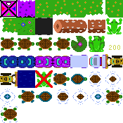

# EntityEngine

EntityEngine is a simple videogame engine written in ~~JavaScript~~ TypeScript, designed to emulate the style and feel of old 8-bit videogames in a modern way, through an HTML Canvas.


It has evolved quite a lot since the very first iterations (originally this was running in tables!) and has since been rewritten in TypeScript for better usability. The newer syntax is much more modern and tries to follow the easy to use and understand style other engines have created.


Huge thanks to my friend [Rachael Cowan](https://www.linkedin.com/in/rachael-cowan-41606522a/), for helping me [with some initial problems](https://github.com/Xerren09/EntityEngine/blob/main/docs/RenderingPerformanceCaseStudy.md  "Read the case description here"), without her help, the graphics system wouldn't be half as good.

*Note, that this is maintained as a fun little sideproject.*


## Engine

### Basics

Initiating the engine is done by creating a new instance, then attaching it to a HTML Canvas element.

```javascript
const engine =  new  EntityEngine();
engine.AttachToCanvas("gameArea");

```

There are 3 main functions that provide the engine loop. All of them can be overwritten to be used.

##### Awake

Awake is called on start-up, and is meant to be used for initialisation. Create and load everything you need here!
```js
engine.Awake  = () => { };
```

##### Update

This function is called once per frame (60 times a second by default), and us the core update loop. Any gameplay logic should be executed here.

```js
engine.Update  = () => { };
```

##### CustomRender

This is called after the internal rendering pass is completed. Can be used to draw up custom UI on top of the already rendered items.
This function had one parameter, the renderer, which can be used directly to draw.

```js
engine.CustomRender  = (renderer) => { };
```

### Pausing

There are several ways to stop the engine, either temporarily or permanently.

#### Wait

Stops the engine for the specified amount of time (milliseconds).
```js
engine.Wait(1500);
```
This wait can be cancelled by calling `CancelWait()`.

#### Stop

Stops the engine completely, and indefinitely (also calls `CancelWait()` in the background).

From this state, there are two ways to restart:
Either calling `Restart()`, which immediately restarts execution like nothing happened,
or by calling `Start()`, which completely resets the game to its default configuration, and then starts again.

### Performance

There are various performance stats that are available directly on the engine instance:

#### GetExecutionTime
Gets the time the engine needs to execute a single frame in milliseconds.

#### GetExecutionIdleTime
Gets the time the engine is idling between frames in milliseconds. E.g.: the time between the end of the current frame, and the start of the next frame, where the engine is just waiting.

#### GetVirtualFrameRate
Gets the potential framerate that the engine could currently execute at. E.g: the maximum framerate with the current execution time that could be achieved.

## Entities

Entities are the basic elements of a game, representing game objects. They are used to represent everything from terrain, backgrounds, and obstacles, to items, interactable, enemies and player(s).

Creating and setting up a new entity is simple, and uses a familiar syntax to most modern videogame engines:

```javascript
let  player  =  new  Entity("player");
player.Size = { width: 100, height: 25 };
player.Position = { x: 25, y: 25 };
player.Sprite =  new  Sprite("testSpriteNormal", ["#FF00FF"]);
player.Tags.push("player");
```

`Size` and `Position` both default to 0 values unless manually set at the start. Generally, size should be cleanly divisible by the tile size of the attached sprite.

Tags are used for searching entities and getting a list of colliding ones.

See [Sprites](#sprites) for more info about how add and manage different sprites to entities. By default, they do not have colour, and are completely transparent.

To properly use an entity, it needs to be registered internally:

```javascript
Entities.Register(player);
```

In case the entity is no longer needed (e.g.: an enemy), it can be destroyed:

```javascript
Entities.Destroy(player);
```

### Getting an entity

#### By ID

Searching for a specific enemy can be done by using its ID:
```javascript
let  player  =  Entities.Find("player");
```

#### By Tags

Searching by tags returns an array of entities that have the specific tag:

```javascript
let  enemies  =  Entities.FindAllTagged("enemy");
```
### Moving an entity

Moving entities can be done by either calling the `Translate` or `MoveTowards` method:

#### Translate
Moves an entity by the given vector.

```javascript
let  player  =  new  Entity("player");
player.Translate({x: 1,});
```

In order to have a fixed stepsize, multiple the vector values by `engine.DeltaTime()`:

```javascript
player.Translate({x: 1 * engine.DeltaTime(), y: 0});
```

#### MoveTowards

Moves an entity towards a given coordinate by the specified step size. Under the hood, this uses `Translate` for the actual movement.

```javascript
let player = new Entity("player");
player.player.MoveTowards({x: 100, y: 100}, 10);
```

In order to have a fixed step size, multiple the step size by `engine.DeltaTime()`;

## Sprites

Sprites provide the visual elements of a game. They can be static or animated, single coloured or images from a Sprite sheet.

#### Sprite Sheet

Sprite sheets provide detailed image support for sprites. They can be any type that the HTML Image API understands:



When creating a new sprite sheet, a unique ID is required, so it can be referenced later, as well as the file path/name, and the tile size in pixels (this should be uniform for every sprite within a sheet).
```javascript
let spriteSheet = new SpriteSheet("testSheet", "spritesheet.png", { width: 25, height: 25 });
```

The image element will be loaded before the engine's awake function runs, during startup, for every registered spritesheet. Upon loading, a built-in preprocessor will index the tiles, which are available in the `IndexMatrix` property (0 based indexing).

By default, spritesheets aren't meant to be interacted with manually, beside referencing their IDs in other sprites.

#### Sprite

Basic sprites provide static texture for entities. They can handle both hex-colours and sprite sheet indexes (at the same time).
If a sprite only uses hex-colours, providing a sprite sheet ID is not necessary.
```javascript
player.Sprite = new Sprite("testSpriteNormal", ["#FF00FF"]);
// OR
player.Sprite = new Sprite("testSpriteNormal", [1, 2 , 3], "testSheet");
// OR
player.Sprite = new Sprite("testSpriteNormal", [1, "#FF00FF", 3], "testSheet");
```
Sprites are rendered left to right, according to their tile size. A sprite's contents will wrap around and cycle until the entire entity is filled. The tile size will be taken from the referenced sprite sheet, if any, which will cause hex-colours to be drawn in identical sized segments too.


#### AnimatedSprite

Animated sprites, as the name implies, provide animated sprites, with the caveat of only a single "frame" being available at a time, which is repeated to fill the entire entity. Additionally, the animation speed (ms) is also required.

```javascript
player.Sprite = new AnimatedSprite("testSprite", 100, ["#FF00FF", "#00FF00", "#FF00FF"], "testSheet");
// OR
player.Sprite = new AnimatedSprite("testSprite", 100, [1, 2, 3], "testSheet");
// OR
player.Sprite = new AnimatedSprite("testSprite", 100, [1, "#FF00FF", 3], "testSheet");
```

Animated sprites will update every given millisecond, although there might be a slight delay due to how rendering works (update may be delayed by up to a frame's idle time). The `Value` property provides the current in-frame element, which dynamically updates.

## Simple example

This is a simple demonstration of the engine, using the above sprite sheet as an example. The player entity will slowly move towards and follow the current cursor position above the canvas.

```js
// Create a new engine instance
const engine = new EntityEngine();

let player;

let mousePosition = { x: 0, y: 0 };

// This function will run on engine start-up, and acts as an initialiser
engine.Awake = () => {
    // Create and register a new sprite sheet. The image component will be loaded on engine start-up
    let spriteSheet = new SpriteSheet("testSheet", "spritesheet.png", { width: 25, height: 25 });
    SpriteSheets.Register(spriteSheet);

    player = new Entity("player");
    // An animated sprite that updates every 100ms, loops through tile 1-3 of the "testSheet" sprite sheet.
    player.Sprite = new Sprite("testSpriteNormal", [1], "testSheet");
    player.Size = { width: 25, height: 25 };
    // Register entity. This is needed for it to be rendered and recognised by the engine.
    Entities.Register(player);
};

// This function runs every frame
engine.Update = () => {
    // Move the player toward the mouse position, 10 pixels a second
    player.MoveTowards(mousePosition, (10 * engine.DeltaTime()));
};

// Attach the engine to a HTML Canvas. This gets the renderer and context by default
engine.AttachToCanvas("gameArea");

// Adds an event listener to the canvas attached to the engine
// This one gets the coordinates of the mouse on the canvas
engine.Renderer.Canvas.addEventListener("mousemove", function (e) {
    var cRect = engine.Renderer.Canvas.getBoundingClientRect();
    var canvasX = Math.round(e.clientX - cRect.left);
    var canvasY = Math.round(e.clientY - cRect.top);
    mousePosition = { x: canvasX, y: canvasY };
});

// Start the engine
engine.Start();
```