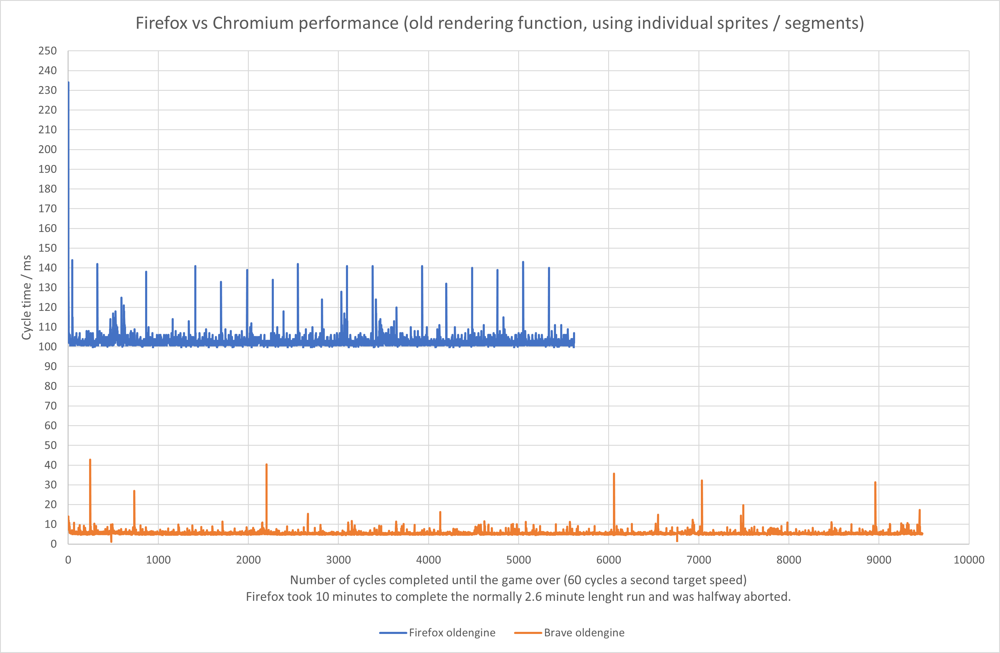
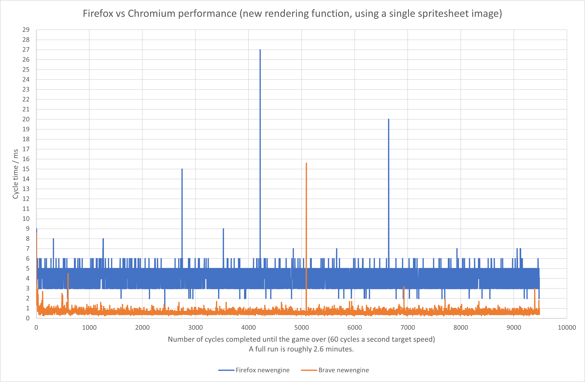

# A nasty rendering performance challenge

### Note
> This was written in 2021, during my first year in university, about the performance of the first version of this engine (as that, most of this code doesn't exist anymore). Since then it has went through a lot of changes, and I learnt a whole lot more too, but it's still an interesting read!
> Also, without Rachael's help, none of the project would be around, since a lot of it builds upon what is detailed here.

Quite early in the project there was a weird feeling of sloggyness when it came to testing the engine with a simple game [Frogger](https://github.com/Xerren09/Frogger). It ran *okay*, but not *well*; at least not as well as I would have expected from such a small game. Although previously I only used Unity engine, I was sure a web browser’s JavaScript engine cannot be that much different in terms of speed in such a trivial case.

## Investigation

Right off the bat I decided to write a small function to measure time between the start and end of a cycle and save it to memory so I can export it later. Sure enough, the runtime was around *120ms* per cycle, often peaking even higher as the game went on, sometimes well into the 300s. With some loop optimisations it did seem to settle around a 100, but it was still way too high.

I figured out selecting the given sprite and drawing it up on the canvas took up the majority of that 100ms. The game was working with very small, 25 by 25-pixel image***s*** that were cached, so it was still weird that a bunch of tiny pictures would put such a dent into performance.

Even weirder, when I showed the game to my friend [Rachael](https://www.linkedin.com/in/rachael-cowan-41606522a/), it somehow ran perfectly fine on her computer. We quickly figured out it was because that was running on a chromium-based browser, while I was running it on Firefox.

I got the game up and running side by side on a chromium-based browser (Brave) and Firefox to capture the performance:



Somehow chromium had no issues at all and was *easily* bringing the performance expected.

## Solution

The issue was clear at this point: Firefox can't handle rapidly loading, drawing, and unloading images, while others can. 

Specifically, issue was dynamically assigning an image to a variable that would change for every 25 by 25-pixel segment, every time a new segment would needed to be rendered (theoretically even this could have been optimised with not switching segments until they are no longer needed, but the gains are probably very small compared to the complexity of an algorithm like that). Not knowing much about rendering optimisations, I didn't really have any idea how to solve this issue. 

Then Rachael suggested combining the separate sprites into a single sprite sheet and rendering off that. This is how I ended up with a simple indexer that would find the position of a given segment based on its index:

```javascript
EntityGraphics.SpriteSheetIndexer = function (indexNum) {
    let indexWidth = EntityEngine.spriteSheet.width / EntityEngine.spriteSheet.tileSize;
    let rowNumber = Math.ceil(indexNum / indexWidth) - 1;
    let columnNumber = (indexNum - ((rowNumber) * (indexWidth))) - 1;
    //
    let returnIndex_row = (rowNumber * EntityEngine.spriteSheet.tileSize);
    let returnIndex_column = (columnNumber * EntityEngine.spriteSheet.tileSize);
    //
    return {
        rowIndex: returnIndex_row,
        columnIndex: returnIndex_column
    };
}
```
While the actual rendering is done by only rendering a specific segment of the sprite sheet:
```js
let tsize = EntityEngine.spriteSheet.tileSize;
objectSpriteList.sprites.forEach((spriteElement, index) => {
    let spriteSheetLocation = EntityGraphics.SpriteSheetIndexer(parseInt(spriteElement));
    for (let i = 0; i < (element.height / tsize); i++) {
        EntityEngine.renderer.drawImage(EntityEngine.spriteSheet.img, spriteSheetLocation.columnIndex, spriteSheetLocation.rowIndex, tsize, tsize, element.x + ((index) * EntityEngine.spriteSheet.tileSize), element.y + (i * tsize), tsize, tsize);
    }
});
```
The major performance gain comes from the fact that this way there is only one image loaded in, and the variable newer changes; making it extremely cheap to perform actions on, in contrast with individual images being loaded, used, unloaded constantly, hundred times a rendering cycle. Right after changing the rendering method, it became evident just how much it really meant:



## Conclusion

The biggest issue here wasn't necessarily the complexity of the problem, but the relative absurdity. Considering how little is actually being done on paper, I never expected the simplest solution I could come up with to cause a problem this massive in such an obscure way. 

And even then, as someone who have never worked with graphics, I wouldn't have realised how much more efficient this can be made by using a sprite sheet if it weren't for Rachael's know-how in this field, which absolutely saved the whole project at the end (Huge thanks!).

(A small end note: interestingly, my professor never ran into this issue despite holding this course for multiple years at that point, and couldn't provide much insight, probably because he prefers chromium-based browsers too.)
